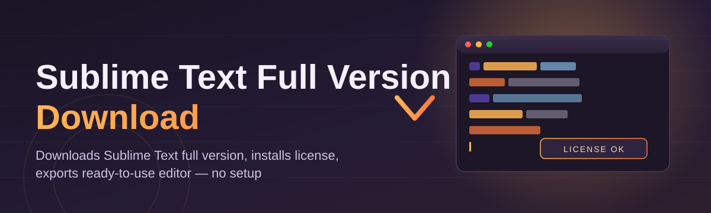
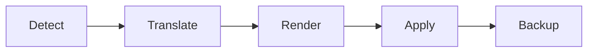

# sublime-text-config-editor 🧩✨

  

*A настроечный layer for Sublime Text that turns your editor from "installed" into "yours" — in minutes, not weekends.*

  

---

## 📖 Overview

`sublime-text-config-editor` started as a weekend itch-scratch and turned into the tool I open before every single coding session. If you've ever spent an evening hand-editing `.sublime-settings` JSON files, hunting for the right package to fix syntax highlighting, or trying to figure out where the Sublime Text full version download actually lives without wading through sketchy mirror sites, this project exists because I got tired of doing that too.

At its core, this is a configuration companion for Sublime Text — it doesn't replace the editor, it *amplifies* it. It reads your existing setup, gives you a clean visual layer over the settings you'd otherwise be editing raw, and helps you get a fully configured, full-feature Sublime Text environment running fast on Windows. Whether you're a student setting up your first real code editor, a backend dev migrating from VS Code, or someone who just wants a legitimately sourced, full version download without the guesswork — this tool is built for you.

This isn't a fork of Sublime Text and it isn't a package manager clone. It's the missing control panel — the thing that should have shipped in the box. Every release is shaped by feedback from people actually using it daily, which is why the roadmap below is public and the discussions tab is where most of the real decisions get made.

## 🚀 Get It Now

> [!NOTE]
> The button above sends you to our official landing page, where the current Windows build and the Sublime Text full version download package are always kept in sync with the latest release notes.

---

## 🔥 What It Actually Does

- **Visual settings editor** — no more guessing at JSON keys; every preference is exposed through labeled fields with live previews, so tweaking your setup feels like configuring an app, not editing a config file.

- **One-click theme staging** — preview color schemes and UI themes side-by-side before committing, with instant rollback if a theme turns out to be unreadable at 2 AM.

- **Package profile snapshots** — save your entire package + keybinding + settings combo as a named profile, then swap between "Writing Mode," "Python Deep Dive," or "Markdown Zen" in seconds.

- **Guided full setup wizard** — for fresh installs, the wizard walks through pulling a legitimate Sublime Text full version download, applying sane defaults, and layering your personal config on top.

- **Conflict detector** — scans your settings tree for duplicate keys, overridden shortcuts, and packages silently fighting each other, then explains the conflict in plain language.

- **Portable export** — bundle your whole configuration into a single shareable file, so your setup travels with you across machines without manual re-entry.

- **Offline-first architecture** — once downloaded, the tool needs no constant connection; your config stays local and yours.

- **Changelog-aware updates** — every update to the tool ships with a human-readable summary of what changed and why, not just a version bump.

> [!TIP]
> New to Sublime Text entirely? Run the guided setup wizard first — it's the fastest path from zero to a fully themed, fully configured editor.

---

## 🏁 How To Get Started

1. **Visit the landing page** using the download button above — that's the only place we publish builds.

2. **Download the installer** for Windows 10/11; it's a single standalone executable, nothing else to fetch.

3. **Run it** — the app opens straight into the setup wizard if it detects a fresh Sublime Text install, or into the main editor dashboard if it finds an existing config.

4. **Pick a starting profile** (Minimal, Balanced, or Power User) and start tweaking — every change previews live before you save it.

> [!IMPORTANT]
> Always grab the tool from the official landing page linked in this README. We do not maintain mirrors, and third-party redistributions are outside our control.

---

## 💻 System Requirements

| Requirement | Detail |
|---|---|
| OS | Windows 10 or Windows 11 (64-bit) |
| Dependencies | None — fully standalone |
| Disk space | ~120 MB free |
| Sublime Text | Detected automatically, or guided install offered |
| Internet | Only required for the initial download |

---

## ⚙️ How It Works

The tool operates in a straightforward pipeline — detect, translate, render, apply. Nothing exotic, no background daemons, no hidden services phoning home.

1. **Detect** your current Sublime Text install path and existing config files.
2. **Translate** raw `.sublime-settings` and keymap JSON into a structured internal model.
3. **Render** that model into the visual editor UI you actually interact with.
4. **Apply** your changes back to disk in the exact format Sublime Text expects, with automatic backups before every write.

> [!WARNING]
> Always let the tool create its automatic backup before applying sweeping changes — reverting is instant if a package interaction goes sideways.

---

## 🧯 Troubleshooting

**Q: The tool can't find my Sublime Text installation — what now?**
A: Point it manually via *Settings → Install Path*. This usually happens with portable or non-default install locations.

**Q: I downloaded the full version but themes aren't rendering correctly.**
A: Clear the theme cache from the app's *Maintenance* tab, then re-apply your saved profile.

**Q: My keybindings reverted after an update.**
A: Restore from the automatic backup created before the update — it lives in the `backups/` folder next to your config.

**Q: Does this modify Sublime Text's core files?**
A: No — it only writes to user-level settings and keymap files, never the application's internal binaries.

**Q: The app won't launch on a fresh Windows install.**
A: Make sure Windows isn't blocking the executable via SmartScreen; right-click → Properties → Unblock, then relaunch.

**Q: Can I sync my config between two machines?**
A: Yes — export a portable profile bundle on one machine and import it on the other from the *Profiles* menu.

---

## 🎨 UI / UX Details

<strong>Keyboard shortcuts</strong>

- `Ctrl+S` — Save current profile
- `Ctrl+Shift+P` — Open profile switcher
- `Ctrl+K, Ctrl+T` — Toggle theme preview mode
- `Ctrl+Z` — Revert last applied change
- `F5` — Refresh settings detection

<strong>Themes & appearance</strong>

- Ships with Light, Dark, and High-Contrast UI modes for the editor itself.
- Theme previews render against sample code so you're not guessing how it'll look mid-project.
- Custom accent colors can be set independently of the base theme.

> [!TIP]
> Settings changes highlight in the sidebar until saved, so you always know exactly what's pending versus applied.

---

## 🤝 Contributing & Community

This project grows because people actually use it and tell us what's broken or missing — that feedback loop *is* the roadmap.

- **Discussions** — feature ideas, setup questions, and "how did you configure this" threads all live in the Discussions tab.
- **Issues** — bug reports with reproduction steps get triaged first; templates are provided to speed this up.
- **Pull requests** — welcome for anything from typo fixes to new profile presets; please open a discussion first for larger architectural changes.

> [!NOTE]
> Roadmap items are voted on by the community via pinned Discussion threads — upcoming focus areas include cross-profile diffing and a lightweight plugin conflict resolver.

---

## 📄 License

Released under the [MIT License](LICENSE), 2026.

---

## ⚠️ Disclaimer

This project is an independent, community-built configuration companion and is not affiliated with, endorsed by, or sponsored by Sublime HQ. "Sublime Text" is a trademark of its respective owner. This tool assists with configuring an existing or freshly obtained Sublime Text full version download — it does not distribute modified copies of the editor itself.

